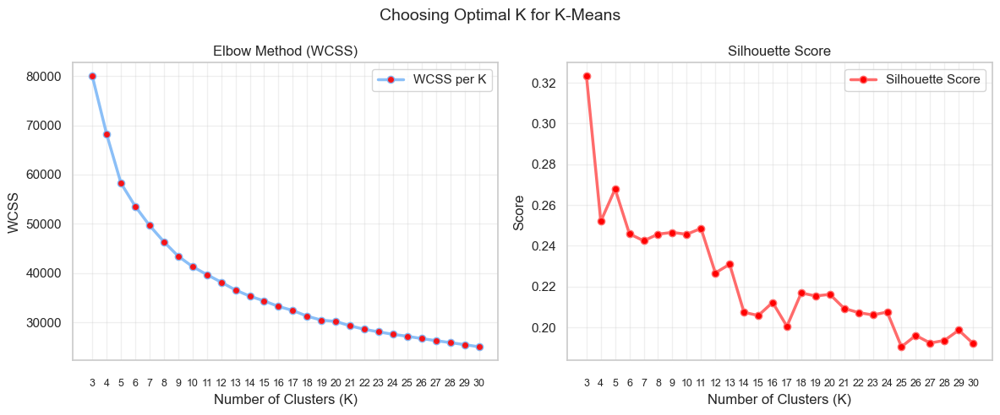
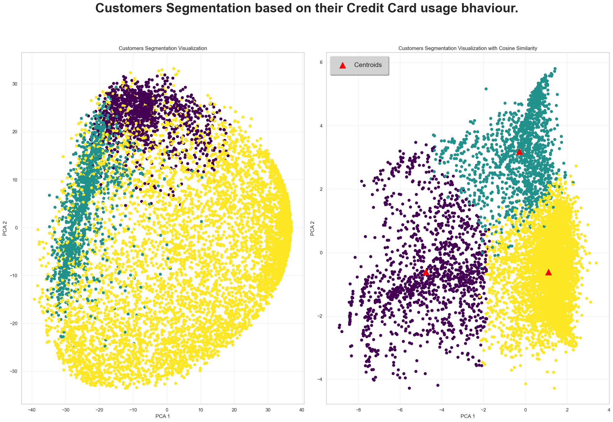

# Credit Card Customer Segmentation & Classification

## 📌 Overview
This project focuses on analyzing **Credit Card Dataset for Clustering**.  
The workflow is divided into two main parts:
1. **Unsupervised Learning (K-Means Clustering)**  
   - Used to segment customers based on their credit card usage patterns.
   - Achieved **0.32 Silhouette Score for Clustering** 🎯
2. **Supervised Learning (Random Forest Classification)**  
   - Built a classification model on the clustered dataset to predict cluster labels.  
   - Achieved **98.88% accuracy** 🎯.

## 📂 Dataset
- **Source:** [Credit Card Dataset for Clustering **(Kaggle)**](https://www.kaggle.com/datasets/arjunbhasin2013/ccdata)  
- **Description:** Contains anonymized credit card usage data for Customers.  
* Features: 
   - **``TENURE``** 
   - **`BALANCE_RANGE`**
   - **`PURCHASES_RANGE`**
   - **`ONEOFF_PURCHASES_RANGE`**
   - **`INSTALLMENTS_PURCHASES_RANGE`**
   - **`CASH_ADVANCE_RANGE`**
   - **`CREDIT_LIMIT_RANGE`** 
   - **`PAYMENTS_RANGE`** 
   - **`MINIMUM_PAYMENTS_RANGE`**
   - **`BALANCE_FREQUENCY_RANGE`**
   - **`PURCHASES_FREQUENCY_RANGE`**
   - **`ONEOFF_PURCHASES_FREQUENCY_RANGE`**
   - **`PURCHASES_INSTALLMENTS_FREQUENCY_RANGE`**
   - **`CASH_ADVANCE_FREQUENCY_RANGE`**
   - **`PRC_FULL_PAYMENT_RANGE`**
   - **`PURCHASES_TRX_RANGE`** 
   - **`CASH_ADVANCE_TRX_RANGE`**

## 🛠️ Methodology
### 1. Data Preprocessing
- Handled missing values.  
- Standardized numerical features.  
- Prepared dataset for clustering.

### 2. Clustering with K-Means
- Chose optimal **`K`** using the **`Elbow method`**.  
- Segmented customers into clusters.  
- Visualized clusters for interpretation.

### 3. Classification with Random Forest
- Used **`K-Means`** cluster assignments as **pseudo-labels**.  
- Trained a **`Random Forest Classifier`** to predict cluster membership.  
- Evaluated performance with accuracy and classification report.

## 📊 Results
- **Silhouette Score for Clustering:** `0.32` ✅
- **Random Forest Accuracy:** `98.88%` ✅  
- **Classification Report:**
  - Precision, Recall, and F1-score all ≈ `0.99`.  
- Strong evidence that clusters are well-separated and predictable.

## 📈 Visualizations

  

Determining the optimal number of clusters using the WCSS (Elbow) technique.

---

  

Visualization of the dataset after applying K-Means clustering.

---
<h3 align="center">Developed as an Independent Machine Learning Project</h3>